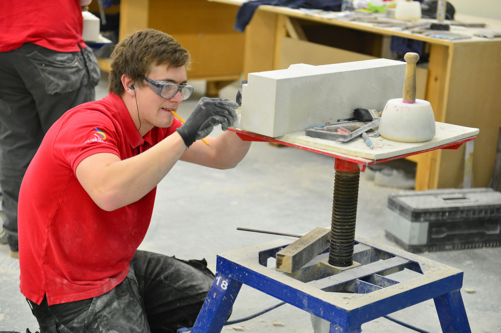

# METU-ALET: A Dataset for Tool Detection in the Wild
ALET is an abbreviation for Autameted Labeling of Equipment and Tools. In Turkish, it also stands for the word “tool”.

METU-ALET is an image dataset for the detection of the tools in the wild. We provide an extensive dataset in order to detect tools that belongs to the categories such as farming, gardening, office, stonemasonry, vehicle, woodworking and workshop. The images in the dataset contains a total of 15612 bounding boxes and 53 different tool categories.  

<!--Please visit ____ for more information on the METU-ALET dataset including the data and the paper.-->

## METU-ALET Dataset at a Glance
Most of the scenes that reside in the dataset are not generated or constructed; they are snapshots of existing environments with or without humans using the tools. The rest of the scenes are generated; therefore, these scenes are considered as synthetic data.

The images that reside in the METU-ALET dataset can be split into three categories: 

### 1) Downloaded and Crawled Data
These are the images that are downloaded and crawled from the Internet. The websites that are used to gather the images are the following: Creativecommons, Wikicommons, Flickr, Pexels, Unsplash, Shopify, Pixabay, Everystock, Imfree. It should also be noted that while crawling and downloading images from these websites, license issues had also been considered. Therefore, we have only taken the royalty-free images from these websites. These type of images in the dataset contains 9262 bounding boxes.

<table>
  <tr>
    <td></td>
    <td></td>
    <td></td>
    <td></td>
  </tr>
</table>

### 2) Photographed Data
These are the images that are photographed by ourselves that are mostly consisting of office and workshop scenes. The images in the METU-ALET dataset contains 820 bounding boxes related to this type of data.

<table>
  <tr>
    <td></td>
    <td></td>
    <td></td>
    <td></td>
  </tr>
</table>

### 3) Synthetic data
In order to make sure that there are at east 200 instances for each tool, we developed a simulation environment and collected synthetic images . For this, we used the Unity3D platform with 3D models of tools acquired from UnityStore. For each scene to be generated, the following steps are followed:
    
* Scene Background: We created a room like environment with 4 walls, 10 different random objects (chair, sofa, corner-piece, television) in static positions. At the center of the room, we spawned one of six different tables selected randomly from $Uniform(1, 6)$. To introduce more randomness, we also dropped unrelated objects like mugs, bottles etc. randomly.
* Camera: Each dimension of the camera position (x, y, z) was sampled randomly from $Uniform(-3, 3)$. Camera's viewing direction was set towards the center of the top of the table.
* Tools: In each scene, we spawned $N \sim Uniform(5,20)$ tools which are selected randomly from $Uniform(1,49)$. The spawn tools are dropped onto the table from $[x,y,z]$ selected randomly from $Uniform(0, 1)$ above the table. Initial orientation (each dimension) is sampled from $Uniform(0,360)$.

The special cases when the sampled camera not seeing the table-top etc. are handled using hand-designed rules.

## Why need METU-ALET dataset?
Through the recent advancements in the field of robotics, we have come to a point where humans and robots will be performing tasks in a collaborative manner. By the help of this dataset, we aim to solve the object detection tasks where robots will be able to detect tools that can be grabed or carried by them. As the definition of a tool is too broad, it had been decided to consider only the tools for the dataset which can be manipulated by the robots.

## The Aim of the METU-ALET dataset
As the datasets that are used in the field of robotics consider only a limited number of categories and instances, and they mainly focus on detection of tool affordances, they are not suitable for training a deep object detector. With METU-ALET, we introduce a dataset which consists of real-life scenes where the tools are unorganized as much as possible, and where the tools can be found in their natural habitat or while humans are using them.

The scenes that we consider also introduce several challenges for the object detection task, such as including the small scale of the tools, their articulated nature, occlusion and inter-class invariance.

## Annotated Samples
<table>
  <tr>
    <td></td>
    <td></td>
    <td></td>
    <td></td>
  </tr>
</table>

<!--## Tool Detection with Deep Networks-->

<!--For tool detection in the wild, we trained several state of the art deep object detectors, namely, <a href="https://arxiv.org/abs/1506.01497">Faster R-CNN</a>, <a href="https://arxiv.org/abs/1512.02325">SSD</a>, <a href="https://arxiv.org/abs/1506.02640">YOLO</a> and <a href="https://arxiv.org/abs/1708.02002">RetinaNet</a>. The following table summarizes the mAP results for each one of the deep object detectors.

<!--| Faster-RCNN | YOLO | RetinaNet |
| --- | --- | --- |
| 0.52 | 0.61 | 0.53 |-->

## “Safety Usecase?”: A Critical and Practical Usage of the METU-ALET Dataset

We created a CNN architecture consisting of three 2D convolutional layers and two fully connected layers. After each convolutional layer we added a batch normalization layer, and  each layer is also followed by ReLu activation. The final layer has five outputs with sigmoid activation. The network performs five-class (one for each safety tool) multi-label classification with binary cross-entropy. The network is trained on ALET Safety Dataset.

An alternative approach could be to combine the results of the tool detector and the pose detector. However, considering that the tool detection networks are having acceptable performance, we adopted an independent network for safety detection. Moreover, a tool detector would be detecting 49 tools in a scene 43 of which are irrelevant for our safety usecase. 

   
  

## The Dataset

The first version of the ALET Dataset is accessible from following links.

* The full ALET DATASET http://kovan.ceng.metu.edu.tr/~fkurnaz/ALET

## Citation

If you use the METU-ALET dataset or the related resources shared here, please cite the following work:
<pre>
@article{KurnazEtAl2019,
    author = {Kurnaz, F. C. and Hocaoglu, B. and Yilmaz, K. M. and Sulo, I. and Kalkan, S.},
    title = {ALET (Automated Labeling of Equipment and Tools): A Dataset, a Baseline and a Usecase for Tool Detection in the Wild},
    journal = {arxiv preprint},
    year = {2019}
}
</pre>

## Contact

For questions or comments please contact Sinan Kalkan at skalkan [@] ceng.metu.edu.tr or visit http://kovan.ceng.metu.edu.tr/index.php/Main_Page.
